  

# 💫 About Me:
🔭 I’m currently working on "BDAM - Blockchain Digital Asset Management" 🤝 I’m looking to collaborate on interesting open-source, AI/ML & systems projects 🛠️ I’m looking for help with Rust, systems programming & low-level concepts 🌱 I’m currently learning Rust, DSA & deeper systems engineering 💬 Ask me about Web Development, AI/ML, Blockchain & Hackathons ⚡ Fun fact: I’d rather build something weird than another todo app.

## 🌐 Socials:
  

# 💻 Tech Stack:
                  
# 📊 GitHub Stats:
 
 

### ✍️ Random Dev Quote

---

<!-- Proudly created with GPRM ( https://gprm.itsvg.in ) -->
